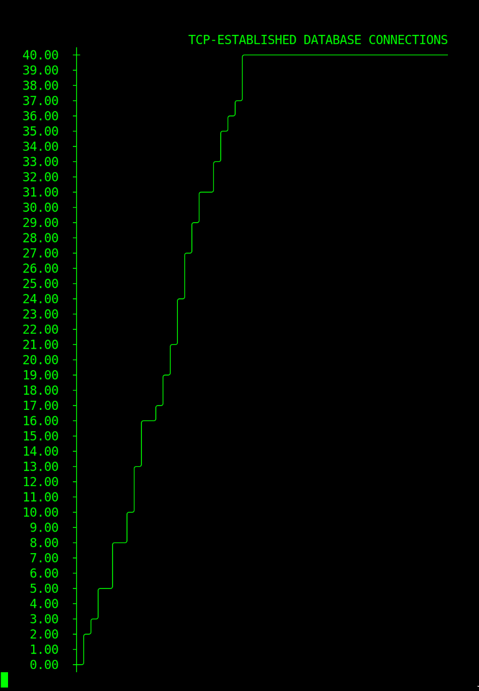

# Code sample to demonstrate the ADO.NET connection pool mechanics


Usage:

```bash
$ export CONNSTR="your_SQLServer_connection_string"
```

Edit Main() in Program.cs.

### Build -

```bash
make build
# or
dotnet restore && dotnet build
```

### Clean -
```
make clean
```

### Run -

```bash
make run
# or
dotnet run
# or
dotnet run | ./chart.py
```


